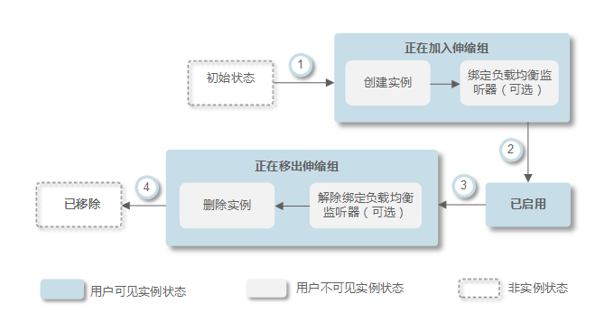
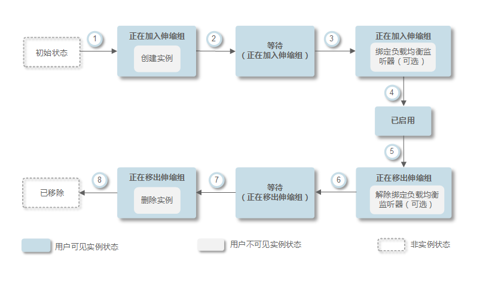
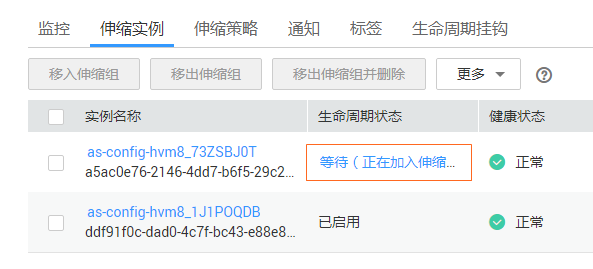

# 生命周期挂钩

生命周期挂钩功能提供灵活控制伸缩组内ECS实例创建和移出过程的能力，以便用户灵活管理ECS实例的生命周期。伸缩组中未添加生命周期挂钩时，实例生命周期状态如[图1](#fig9892349365)所示。

**图 1**  实例生命周期状态  

添加生命周期挂钩后，实例生命周期状态如[图2](#fig32791162165412)所示。

**图 2**  添加生命周期挂钩后实例生命周期状态  

当伸缩组中发生伸缩活动，触发生命周期挂钩时，伸缩活动将被挂起，正在进行伸缩活动的实例会被置为等待状态，如[图2](#fig32791162165412)中②和⑥。您可在实例保持等待状态时进行一些自定义操作。例如，在新实例移入伸缩组时，您可以在其上安装或配置软件。有以下两种方式可以结束被挂起的伸缩活动：

-   实例保持等待的时间大于超时时间。
-   手动执行回调操作，主动结束实例等待状态。

## 使用场景

-   伸缩组中新移入的实例，需要先进行初始化（安装或配置软件等）并检测服务正常运行后，再绑定到负载均衡监听器对外提供服务。
-   伸缩组中的实例被释放之前，需要先从负载均衡监听器上解绑以确保不再接收新的请求，待检测已经接收到的请求处理完毕后进行释放。
-   伸缩组中的实例被释放之前，需要执行数据备份操作或者下载日志文件。
-   其它需要执行自定义操作的场景。

## 工作原理

将生命周期挂钩添加到伸缩组后，生命周期挂钩将按照如下方式工作：

-   实例移入伸缩组

    实例移入伸缩组并且初始化完成之后，自动触发挂钩类型为“实例启动”的生命周期挂钩，实例进入“等待（正在加入伸缩组）”状态，即实例被挂钩挂起。若您配置了一个通知目标，则系统会向该目标发送消息。收到消息后，您可以执行自定义操作，例如在实例上安装软件。自定义操作执行完成后，您可以手动执行回调操作，结束实例等待状态。或等待超时时间结束，系统自动结束实例等待状态。实例等待状态结束之后的默认回调操作有两种执行方案，“继续”或“终止”。这两种执行方案解释如下：

    -   继续：处于等待状态的实例将加入伸缩组。
    -   终止：处于等待状态的实例将被直接删除并重新创建新实例。

    若配置了多个“实例启动”类型的生命周期挂钩，实例移入伸缩组会触发多个生命周期挂钩，若有一个挂钩默认回调操作为“终止”时，将会直接删除实例并重新创建新实例。若所有挂钩默认回调操作都为“继续”时，则会等待最后一个挂钩挂起结束后，将实例加入伸缩组。

-   实例移出伸缩组

    实例移出伸缩组时，先进入正在移出伸缩组状态，触发生命周期挂钩后，实例进入“等待（正在移出伸缩组）”状态。系统会向您配置的通知目标发送消息，收到消息后，您可以执行自定义操作，如卸载实例上的软件、备份数据等。自定义操作执行完成之后，您可以选择手动执行默认回调操作或等待超时时间超时来结束实例等待状态。等待状态结束后实例有两种执行方案，继续或终止，这两种执行方案解释如下：

    -   继续：将实例移出伸缩组
    -   终止：将实例移出伸缩组

    当有多个挂钩时，“继续”表示继续等待其他挂钩挂起超时，只有所有挂钩状态都为“继续”时，才会将实例移出伸缩组。只要有一个挂钩默认回调操作为“终止”，会直接将实例移出伸缩组。

## 使用限制

-   添加挂钩、删除挂钩、修改挂钩等操作都是在该伸缩组未进行伸缩活动时可操作。
-   一个伸缩组内最多可添加5个生命周期挂钩。

## 如何添加挂钩

1.  登录管理控制台。
2.  选择“计算 \> 弹性伸缩 \> 伸缩实例 \> 弹性伸缩组”。
3.  单击需要添加生命周期挂钩的弹性伸缩组名称，进入伸缩组的“基本信息”界面，选择“生命周期挂钩”页签，单击“添加生命周期挂钩”。
4.  在“添加生命周期挂钩”界面，根据界面提示进行参数配置，如[表1](#table14431103919157)所示。

    **表 1**  参数配置

    
    <table><thead align="left"><tr id="row114377393158"><th class="cellrowborder" valign="top" width="16.23%" id="mcps1.2.4.1.1">
参数名称

    </th>
    <th class="cellrowborder" valign="top" width="64.35%" id="mcps1.2.4.1.2">
参数说明

    </th>
    <th class="cellrowborder" valign="top" width="19.42%" id="mcps1.2.4.1.3">
取值样例

    </th>
    </tr>
    </thead>
    <tbody><tr id="row54449391154"><td class="cellrowborder" valign="top" width="16.23%" headers="mcps1.2.4.1.1 ">
挂钩名称

    </td>
    <td class="cellrowborder" valign="top" width="64.35%" headers="mcps1.2.4.1.2 ">
生命周期挂钩名称(1～32个字符)，只能由字母、数字、下划线、中划线组成。

    </td>
    <td class="cellrowborder" valign="top" width="19.42%" headers="mcps1.2.4.1.3 ">
we12_w

    </td>
    </tr>
    <tr id="row11453839201512"><td class="cellrowborder" valign="top" width="16.23%" headers="mcps1.2.4.1.1 ">
挂钩类型

    </td>
    <td class="cellrowborder" valign="top" width="64.35%" headers="mcps1.2.4.1.2 ">
挂钩类型包括“实例启动”和“实例终止”，它们分别在实例加入伸缩组和实例移出伸缩组时将实例置于“等待（正在加入伸缩组）”或者“等待（正在移出伸缩组）”状态。

    </td>
    <td class="cellrowborder" valign="top" width="19.42%" headers="mcps1.2.4.1.3 ">
实例启动

    </td>
    </tr>
    <tr id="row64594392158"><td class="cellrowborder" valign="top" width="16.23%" headers="mcps1.2.4.1.1 ">
默认回调操作

    </td>
    <td class="cellrowborder" valign="top" width="64.35%" headers="mcps1.2.4.1.2 ">
默认回调操作是指当实例为等待状态且等待状态的时间已经达到超时时间后的系统默认操作。

    
在当前实例正在加入伸缩组时，默认回调操作的含义为：<ul id="ul44628391156"><li>继续：当有一个挂钩时，表示继续将实例加入伸缩组；当有多个挂钩时，表示继续等待其他挂钩的状态，只有所有挂钩状态都为“继续”时，才会继续将实例加入伸缩组。</li><li>终止：无论有几个挂钩，只要有一个挂钩状态为“终止”，将会直接删除实例并重新创建新实例。</li></ul>
    

    
在当前实例正在移出伸缩组时，默认回调操作的含义为：<ul id="ul19466143971513"><li>继续：当只有一个挂钩时，“继续”表示直接将实例移出伸缩组；当有多个挂钩时，表示继续等待其他挂钩的状态，只有所有挂钩状态都为“继续”时，才会继续将实例移出伸缩组。</li><li>终止：无论有几个个挂钩，只要有一个挂钩状态为“终止”，会直接将实例移出伸缩组。</li></ul>
    

    </td>
    <td class="cellrowborder" valign="top" width="19.42%" headers="mcps1.2.4.1.3 ">
继续

    </td>
    </tr>
    <tr id="row2476439131510"><td class="cellrowborder" valign="top" width="16.23%" headers="mcps1.2.4.1.1 ">
超时时间

    </td>
    <td class="cellrowborder" valign="top" width="64.35%" headers="mcps1.2.4.1.2 ">
默认情况下，实例保持等待状态的时间。取值范围为：300秒~86400秒。

    
您可以延长超时时间，也可以在超时时间结束前进行“继续”或“终止”操作。关于回调操作更多信息请参见<a href="#section01303241231">如何进行回调操作</a>。

    </td>
    <td class="cellrowborder" valign="top" width="19.42%" headers="mcps1.2.4.1.3 ">
3600秒

    </td>
    </tr>
    <tr id="row148483911156"><td class="cellrowborder" valign="top" width="16.23%" headers="mcps1.2.4.1.1 ">
通知主题

    </td>
    <td class="cellrowborder" valign="top" width="64.35%" headers="mcps1.2.4.1.2 ">
为生命周期挂钩定义一个通知目标（请参见《消息通知服务用户指南》创建主题），当实例被挂钩挂起时向该通知目标发送消息。该消息包含实例的基本信息、用户自定义通知消息，以及可用于控制生命周期操作的令牌信息。消息样例如下：

    <pre class="screen" id="screen1489113981512">{
     "service": "AutoScaling",
     "tenant_id": "93075aa73f6a4fc0a3209490cc57181a",
     "lifecycle_hook_type": "INSTANCE_LAUNCHING",
     "lifecycle_hook_name": "test02",
     "lifecycle_action_key": "4c76c562-9688-45c6-b685-7fd732df310a",
     "notification_metadata": "xxxxxxxxxxxxx",
     "scaling_instance": {
      "instance_id": "89b421e4-5fa6-4733-bf40-6b07a8657256",
      "instance_name": "as-config-kxeg_RM6OCREY",
      "instance_ip": "192.168.0.202"
     },
     "scaling_group": {
      "scaling_group_id": "fe376277-50a6-4e36-bdb0-685da85f1a82",
      "scaling_group_name": "as-group-wyz01",
      "scaling_config_id": "16ca8027-b6cc-45fc-af2d-5a79996f685d",
      "scaling_config_name": "as-config-kxeg"
     }
    }</pre>
    </td>
    <td class="cellrowborder" valign="top" width="19.42%" headers="mcps1.2.4.1.3 ">
-

    </td>
    </tr>
    <tr id="row150853912157"><td class="cellrowborder" valign="top" width="16.23%" headers="mcps1.2.4.1.1 ">
自定义通知消息

    </td>
    <td class="cellrowborder" valign="top" width="64.35%" headers="mcps1.2.4.1.2 ">
当配置了通知目标时，可向其发送用户自定义的通知内容。

    </td>
    <td class="cellrowborder" valign="top" width="19.42%" headers="mcps1.2.4.1.3 ">
-

    </td>
    </tr>
    </tbody>
    </table>

5.  单击“确定”。

    在生命周期挂钩页签可查看到新添加的生命周期挂钩。

## 如何进行回调操作

1.  在伸缩实例页面，单击需要进行回调操作的伸缩组名称，进入弹性伸缩组的“基本信息”界面。
2.  选择“伸缩实例”页签。
3.  单击被挂钩挂起实例“生命周期状态”列下的“等待（正在加入伸缩组）” 或“等待（正在移出伸缩组）”，如[图3](#fig13811117256)所示。

    **图 3**  回调操作入口  
    

    > **说明：**   
    >只有被生命周期挂钩挂起的实例，可执行回调操作。  

4.  在弹出的“伸缩实例挂起信息”界面，可查看某个实例的挂起信息及当前伸缩组中所有的挂钩，并且可对每个挂钩执行回调操作。如[图4](#fig19792349122614)所示。

    **图 4**  伸缩实例挂起信息页面  
    

    回调操作包括：

    -   继续
    -   终止
    -   延长超时时间

    如果您在超时时间结束前已完成自定义操作，选择“继续”或“终止”完成生命周期操作。“继续”或“终止”操作含义请参见[表1](#table14431103919157)。如果您需要更多时间完成自定义操作，选择“延长超时间”延长超时时间，实例保持等待状态的时间将增加3600秒。

## 如何修改挂钩

在“生命周期挂钩”页签，选择要修改的挂钩“操作”列下的“修改”，修改时界面的参数配置请参考[表1](#table14431103919157)，您可以修改除挂钩名称外的其余参数，例如挂钩类型、默认回调操作、超时时间等。

## 如何删除挂钩

在“生命周期挂钩”页签，选择要删除的挂钩“操作”列下的“删除”。

